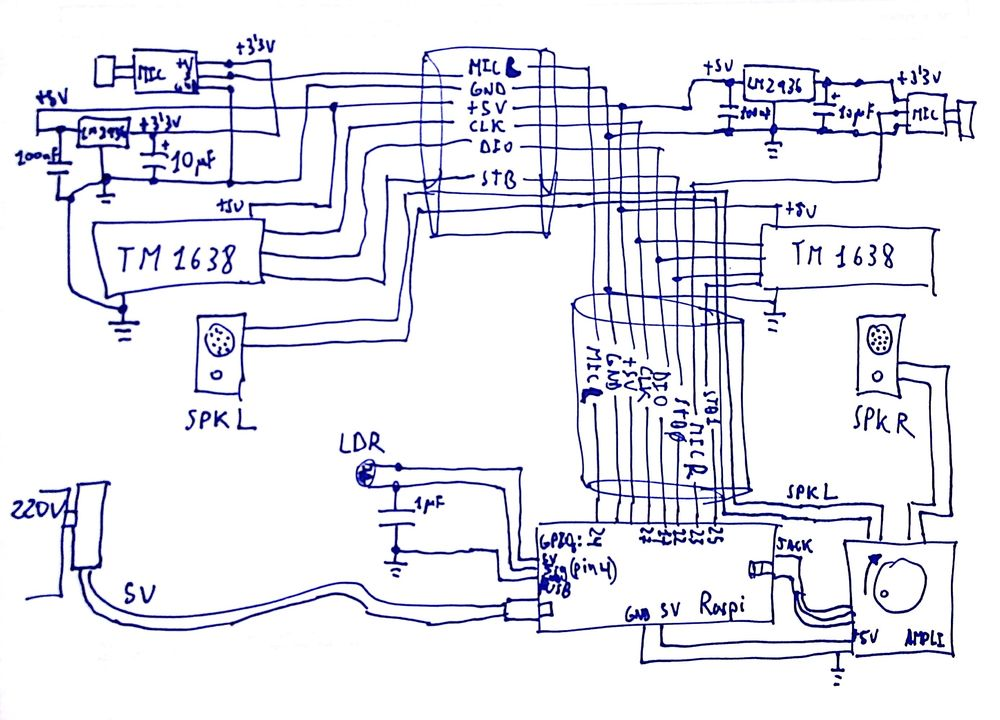

# Desagües musicales

Desarrollado por [CarlosGS](https://github.com/CarlosGS) con la Raspberry Pi de [Víctor Uceda](https://github.com/VictorUceda)


Diagrama del circuito
--



Configuración de la Raspberry
--

Le hemos puesto a la Raspberry Pi una instalación básica de [Raspbian](https://www.raspberrypi.org/downloads/raspbian/) (ver [cómo instalar el .img en una tarjeta SD](https://www.raspberrypi.org/documentation/installation/installing-images/linux.md) )

Para evitar ruido en la reproducción de audio, hay que definir lo siguiente en el fichero "/boot/config.txt"
```
disable_audio_dither=1
```

Para que se ejecute el programa al inicio, hay que poner lo siguiente en el script ".profile":
```
run_desagualeatorio.sh &
```
El & se encarga de hacer un fork para que el proceso corra en segundo plano


Cómo añadir mas música
--

Usando el programa Audacity, cargar el audio deseado y cortarlo para que comience de forma épica y no dure mas de 45 segundos (para que no se haga muy pesado)

Exportar el audio como .ogg, de calidad 1 para comprimirlo, y limpiar todos los metadatos

Finalmente hay que normalizar el volumen de los .ogg con el comando:
```
for audio_file in *.ogg; do
    normalize-ogg $audio_file;
done
```


Origen de los sonidos
--

Los audios han sido obtenidos de:
- <http://www.instantsfun.es/>
- <http://github.com/Diogenesthecynic/FullScreenMario/>
- Edición propia


Licencia del proyecto
--

Creative commons 4.0 share alike

El copyright de los ficheros de audio pertenece a sus respectivos autores

