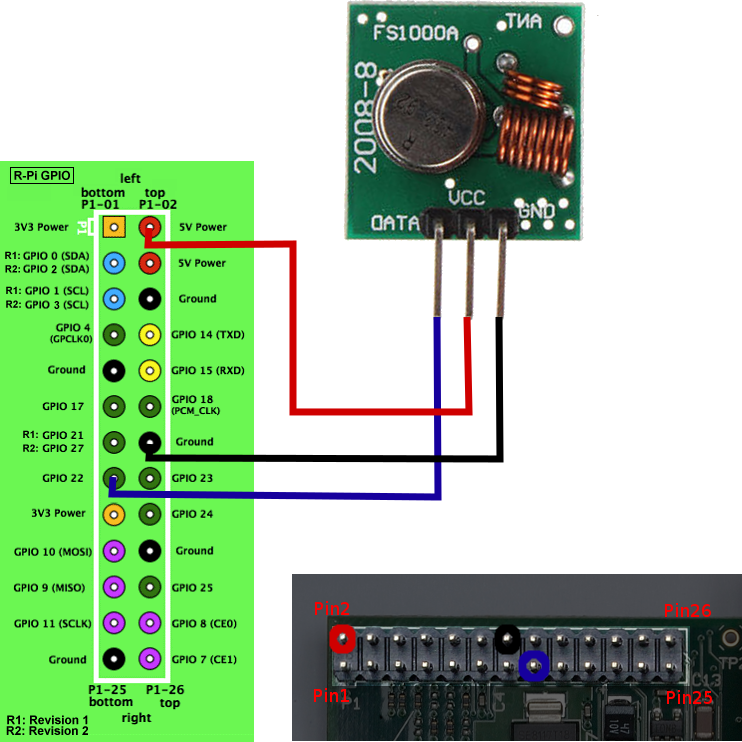

# Pruebas con la Raspberry Pi

Cómo medir un sensor de luz, aun no disponiendo de un conversor ADC: <http://www.ninjagecko.co.uk/how-to-measure-the-amount-of-light-in-a-room-using-a-light-dependent-resistor/>

Para controlar los displays TM1638: <https://github.com/johnblackmore/py-tm1638>

Para controlar los enchufes RF: <https://github.com/lexruee/pi-switch-python>

Pinout de la Raspberry
--

